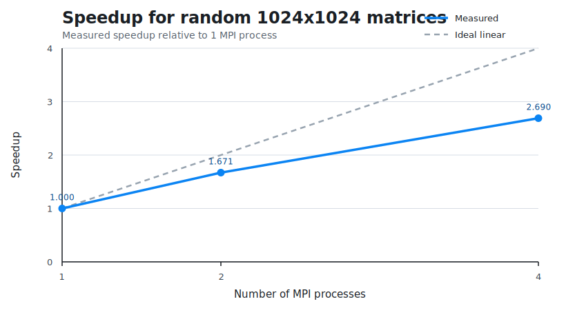

# MPI Matrix Multiplication Project

Проект по дисциплине "Технологии распределённых вычислений".

Реализовано параллельное умножение матриц `C = A * B` на `C++` с использованием `MPI`.
Для форматированного вывода используется внешняя библиотека `fmt`, собранная из исходников из каталога `third_party/fmt`.
Сборка проекта выполняется через `CMake`.

## Структура проекта

- `include/` - заголовочные файлы проекта
- `src/` - исходные файлы проекта
- `cmake/FindMSMPI.cmake` - модуль поиска `MS-MPI` на Windows
- `scripts/build_vs2022.ps1` - сборка проекта через Visual Studio 2022 и `CMake`
- `scripts/generate_matrix_files.ps1` - генерация текстовых файлов с квадратными матрицами заданного размера
- `scripts/run_benchmarks.ps1` - автоматический запуск серии тестов и сохранение статистики
- `data/` - примеры текстовых файлов с матрицами
- `data/generated/` - каталог для автоматически сгенерированных больших матриц
- `docs/performance/` - сохраненные результаты измерений и графики ускорения
- `third_party/fmt/` - исходники внешней библиотеки `fmt`
- `benchmark_results.csv` - файл с результатами измерений производительности

## Что делает программа

Программа выполняет только умножение матриц.
Операции сложения, вычитания или решения СЛАУ в данном проекте не реализованы.

Поддерживаются два режима работы:

1. Генерация случайных матриц внутри программы.
   В этом режиме создаются квадратные матрицы размера `N x N`.
2. Загрузка матриц из текстовых файлов.
   В этом режиме можно использовать как квадратные, так и прямоугольные матрицы, если выполняется условие умножения:
   число столбцов матрицы `A` должно совпадать с числом строк матрицы `B`.

## Как хранятся и распределяются данные

- Полные исходные матрицы изначально находятся только на процессе `0`
- Матрица `B` целиком рассылается всем процессам через `MPI_Bcast`
- Матрица `A` делится по строкам между процессами через `MPI_Scatterv`
- Каждый процесс вычисляет только свой блок строк результирующей матрицы `C`
- Частичные результаты собираются обратно на процессе `0` через `MPI_Gatherv`

## Алгоритм умножения

Используется стандартное умножение матриц:

```text
C[i][j] = sum(A[i][k] * B[k][j])
```

Порядок работы программы:

1. Процесс `0` либо генерирует матрицы, либо считывает их из файлов.
2. Всем процессам передаются размеры матриц.
3. Всем процессам передаётся полная матрица `B`.
4. Строки матрицы `A` распределяются между процессами.
5. Каждый процесс выполняет локальное умножение для своего блока строк.
6. Итоговая матрица `C` собирается на процессе `0`.
7. При запуске с флагом `--verify` на процессе `0` дополнительно вычисляется последовательный результат для проверки корректности.

## Формат файлов матриц

Если используются файлы, каждая матрица хранится в текстовом формате:

```text
rows cols
a11 a12 a13 ...
a21 a22 a23 ...
...
```

В первой строке записаны размеры матрицы: число строк и число столбцов.
Далее записываются все элементы матрицы построчно.

В каталоге `data/` хранятся только небольшие примеры файлов.
Крупные входные данные для экспериментов рекомендуется генерировать отдельно перед запуском программы.

## Сборка на Windows

### Через готовый PowerShell-скрипт

```powershell
powershell -ExecutionPolicy Bypass -File .\scripts\build_vs2022.ps1 -Config Release
```

### Вручную через CMake

```powershell
& "C:\Program Files\Microsoft Visual Studio\2022\Community\Common7\IDE\CommonExtensions\Microsoft\CMake\CMake\bin\cmake.exe" `
  -S . `
  -B build `
  -G "Visual Studio 17 2022" `
  -A x64

& "C:\Program Files\Microsoft Visual Studio\2022\Community\Common7\IDE\CommonExtensions\Microsoft\CMake\CMake\bin\cmake.exe" `
  --build build `
  --config Release
```

## Запуск программы

### Запуск со случайно сгенерированными матрицами

Пример запуска на `4` MPI-процессах:

```powershell
mpiexec -n 4 .\build\Release\mpi_matrix_multiplier.exe --size 1024 --verify
```

В этом режиме обе матрицы имеют размер `1024 x 1024`, если явно не указан другой `--size`.

### Запуск с матрицами из файлов

Пример запуска:

```powershell
mpiexec -n 2 .\build\Release\mpi_matrix_multiplier.exe --matrix-a .\data\matrix_a_4x4.txt --matrix-b .\data\matrix_b_4x4.txt --verify
```

### Генерация больших файлов матриц перед экспериментом

Пример генерации двух квадратных матриц размера `2048 x 2048`:

```powershell
powershell -ExecutionPolicy Bypass -File .\scripts\generate_matrix_files.ps1 -Size 2048 -SeedA 42 -SeedB 43
```

После этого в каталоге `data/generated/` будут созданы файлы:

- `matrix_a_2048.txt`
- `matrix_b_2048.txt`

Пример запуска программы на этих файлах:

```powershell
mpiexec -n 4 .\build\Release\mpi_matrix_multiplier.exe --matrix-a .\data\generated\matrix_a_2048.txt --matrix-b .\data\generated\matrix_b_2048.txt
```

### Параметры командной строки

```text
--size N          размер квадратной матрицы N x N в режиме генерации
--seed S          seed генератора случайных чисел
--matrix-a FILE   путь к файлу с первой матрицей
--matrix-b FILE   путь к файлу со второй матрицей
--repetitions R   число повторов внутри одного запуска
--verify          сравнить MPI-результат с последовательным умножением
--help            показать справку
```

## Как проводился анализ производительности

Анализ производительности выполнялся для одинаковых входных данных при разном числе MPI-процессов.

Для серии тестов использовались запуски на:

- `1` процессе
- `2` процессах
- `4` процессах

Время измеряется внутри программы с помощью `MPI_Wtime()`.
Перед началом измерения используется `MPI_Barrier`, чтобы все процессы начали вычисления одновременно.
После завершения локальных вычислений итоговое время определяется как максимум по всем процессам через `MPI_Reduce`, так как общее время параллельного алгоритма задаётся самым медленным процессом.

Для каждого числа процессов можно выполнять несколько запусков.
По результатам вычисляются:

- `AverageSeconds` - среднее время выполнения
- `MinSeconds` - минимальное время
- `MaxSeconds` - максимальное время
- `Speedup = T1 / Tp`
- `Efficiency = Speedup / p`

где:

- `T1` - время выполнения на одном процессе
- `Tp` - время выполнения на `p` процессах
- `p` - число MPI-процессов

## Автоматический сбор статистики

Для автоматического получения метрик используется скрипт:

```powershell
powershell -ExecutionPolicy Bypass -File .\scripts\run_benchmarks.ps1 `
  -MatrixSize 1024 `
  -ProcessCounts 1,2,4 `
  -Runs 3 `
  -Repetitions 1
```

Скрипт:

- запускает программу несколько раз для каждого числа процессов
- считывает строку `RESULT` из вывода программы
- вычисляет среднее, минимальное и максимальное время
- вычисляет ускорение `Speedup`
- вычисляет эффективность `Efficiency`
- сохраняет результат в `benchmark_results.csv`

## Пример результатов измерений

Ниже приведены результаты для случайно сгенерированных матриц размера `1024 x 1024`.

| MPI-процессы | Среднее время, с | Минимум, с | Максимум, с | Ускорение | Эффективность |
| --- | ---: | ---: | ---: | ---: | ---: |
| 1 | 1.889514 | 1.804772 | 1.944788 | 1.000 | 1.000 |
| 2 | 1.130998 | 1.035239 | 1.193729 | 1.671 | 0.835 |
| 4 | 0.702420 | 0.671265 | 0.721223 | 2.690 | 0.673 |

Файл с этими данными находится в `docs/performance/windows_msmpi_random_1024.csv`.

### График ускорения



Пунктирной линией показано идеальное линейное ускорение, сплошной линией - измеренное ускорение.
